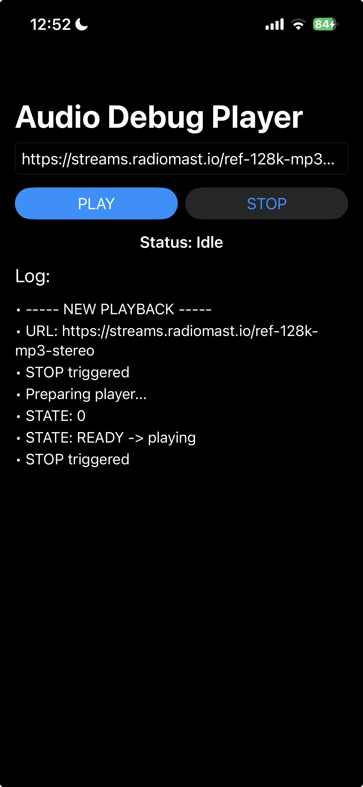
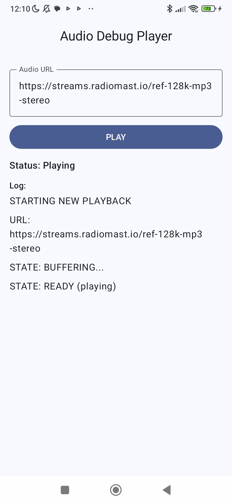

# 🎧 Audio Test

A lightweight cross-platform application to **test audio playback** on **iOS** and **Android**, focused on validating **streaming**, **buffering**, **playback controls**, and **format compatibility**.

## 📱 Platforms & Technologies

| Platform       | Playback Engine      | Notes                                                                    |
| -------------- | -------------------- | ------------------------------------------------------------------------ |
| 🍎 **iOS**     | `AVPlayer`           | Supports streaming, buffering control and playback state events          |
| 🤖 **Android** | `Media3` (ExoPlayer) | Optimized streaming, wide format compatibility and media session support |

## 🎯 Purpose

Designed for developers who need a **minimal yet powerful environment** to:

* 🔊 Test audio playback via remote URLs
* 🪲 Debug playback events, buffering and network behavior
* ❗ Validate error handling and retry logic
* ⚖️ Compare audio performance between platforms

## ✨ Features

* ▶️ Basic playback controls (play, stop)
* 🌐 URL-based audio streaming
* 📡 Real-time logs for debugging
* 🧩 Supports common audio formats: **MP3**, **AAC**, **WAV**, etc.
* 📶 Useful for unstable-network and low-bandwidth tests

## 🛠️ System Requirements

| Platform       | Minimum Version | Language |
| -------------- | --------------- | -------- |
| 🍎 **iOS**     | iOS **17+**     | Swift    |
| 🤖 **Android** | Android **24+** | Kotlin   |

## 📦 Installation & Setup

Clone the repository:

```bash
git clone https://github.com/paulocoutinhox/audio-test.git
```

### 🍎 iOS Setup

```bash
open ios/AudioTest/AudioTest.xcodeproj/
```

Run through **Xcode** using a device or simulator.

### 🤖 Android Setup

```bash
cd android/AudioTest
./gradlew assembleDebug
```

Open the Android folder in **Android Studio** and run the project.

## 🖼️ Screenshots





## 📄 License

MIT License — view [LICENSE](LICENSE)

## 💬 Support

* **Issues:** [https://github.com/paulocoutinhox/audio-test/issues](https://github.com/paulocoutinhox/audio-test/issues)

Made with ❤️ by **[Paulo Coutinho](https://github.com/paulocoutinhox)**
